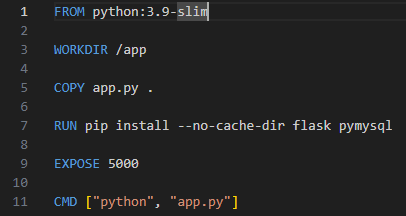
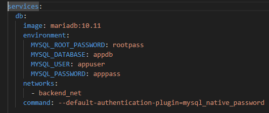
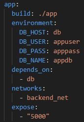
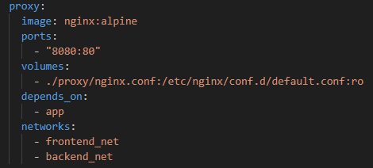
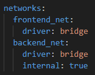
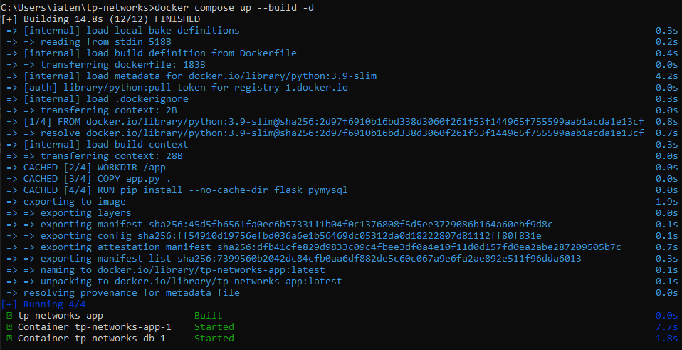
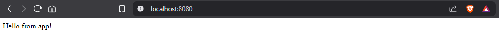
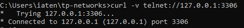

📌 TP-NETWORKS

📝 1. Présentation du projet

Ce projet réalisé via docker compose consiste à mettre en place une petite infrastructure Docker composée de trois services :

- db : base de données MariaDB
- app : application simple (HTTP) qui interroge la base (Flask avec pymysql)
- proxy : serveur Nginx jouant le rôle de reverse proxy

Cette infrastructure est organisée sur deux réseaux Docker distincts :

- app et db dans backend_net
- proxy dans frontend_net et backend_net qui fait le lien entre les deux.

Le proxy empêche la base de donnée d'être accessible directement depuis l’hôte, cependant l’application est joignable via le proxy.

Les technologies principales utilisées sont Docker, pour ce qui est des images, nginx alpine pour le proxy, mariadb pour la base de données.

🐳 2. Le Dockerfile

- Le Dockerfile de ce projet utilise une image Python allégée slim qui nous fournit un environnement Python prêt à l'emploi.
- Définit le répertoire de travail courant à /app dans le conteneur.
- Copie le fichier app.py dans le répertoire courant, soit /app car on vient de le définir ainsi.
- Installation des dépendances nécessaires de Python via pip install (flask pour le framework et pymysql pour se connecter à mariadb).
- Déclare que le conteneur écoute sur le port 5000.
- Commande par défaut pour lancer flask avec python app.py.

🐙 3. Le fichier compose.yml

- On définit les variables d'environnement de mariadb définis dans app.py puis on configure le network en backend.

- L’application est construite à partir du Dockerfile situé dans le dossier ./app, on définit les variables d'environnement pur se connecter à la db, on indique que l'app dépend de la db pour qu'elle se lance après la base de données. L'application est connectée au network backend.
Le port 5000 est accessible aux autres conteneurs du même réseau sans l’exposer à l’extérieur de celui-ci.

- Le proxy utilise l’image nginx alpine. Exposition du port 80 du conteneur sur le port 8080 de l’hôte.
Monte le fichier nginx.conf local dans le conteneur en lecture seule. Le proxy démarre après le service app via depends on.
Le proxy est connecté aux deux réseaux : frontend_net et backend_net.

Pour ce qui est de la partie réseau, le réseau frontend_net est de type bridge pour la communication avec l’hôte, tandis que
le réseau backend_net est de type bridge et internal: true pour isoler les services internes.

******************************************************************************************************************************
Déploiement :
- Une fois dans à la racine du projet après un cd tp-networks, on peut utiliser cette commande : docker compose up --build -d
- 

Le projet a été Built, et les containers Started.

- Lorsque l'on se rend sur localhost:8080, nous avons bien accès à app.py qui nous renvoie "Hello from app!"

🔐 4. Base de données inaccessible depuis l'hôte et application joignable via le proxy

- La base de données est bien inaccessible depuis l'hôte car son port 3306 n'est pas exposé et le réseau backend est interne dans compose.yml.
Afin de s'en assurer nous pouvons effectuer la commande suivante : curl -v telnet://127.0.0.1:3306

- Ici la connexion nous est refusée. Or, si l'on exposait le port 3306 de mariadb et qu'on supprimait la ligne "internal: true" de networks dans compose.yml, l'accès à la base de données serait disponible depuis l'hôte, comment nous pouvons le voir ci-dessous.

- L'application elle, est joignable via le proxy en tapant localhost:8080, qui est bien le port qui lui est attitré dans compose.yml.
Dans nginx.conf, le proxy écoute sur le port 80 et redirige vers le service app sur le port 5000.

☁️ 5. Image disponible sur Docker Hub

- Le lien de l'image sur DockerHub : https://hub.docker.com/r/dockeruserhp/tp-networks-app

- Comment la récupérer via le terminal :

docker pull dockeruserhp/tp-networks-app:latest
